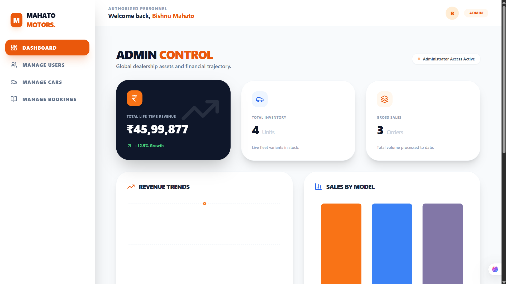
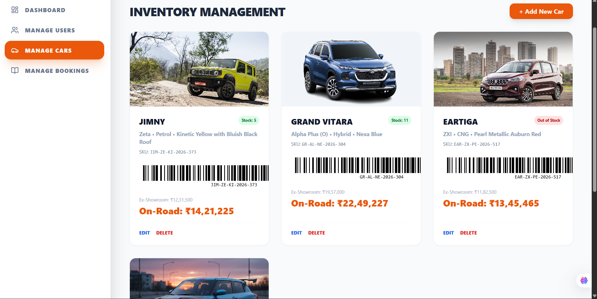
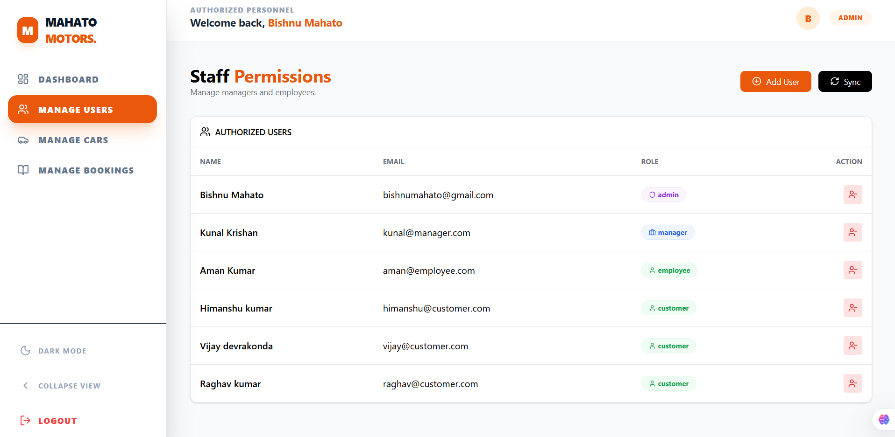
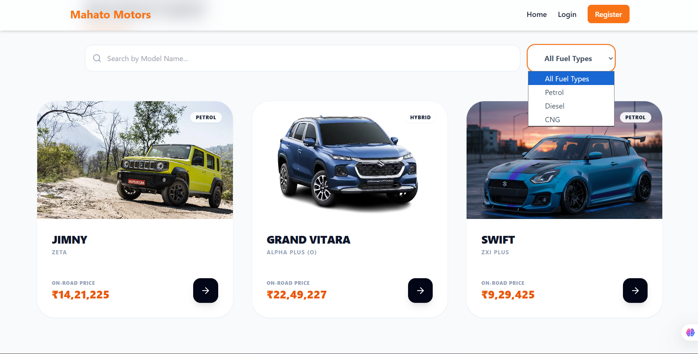

# 🚗 Mahato Motors – Smart Inventory Management System


---

## 🌐 Live Demo

🚀 **Frontend:**
https://inventory-management-system-c2at38hkq.vercel.app/

⚙️ **Backend API:**
https://inventory-management-system-ftg8.onrender.com/

---

## ✨ Features

* 🔐 Role-Based Authentication (Admin, Manager, Employee, Customer)
* 🚘 Car Inventory & Stock Management
* 📦 Supplier & Purchase Management
* 📊 Dashboard with Real-time Analytics
* 📅 Booking & Delivery Tracking
* 🧾 Invoice Generation (PDF)
* 🔎 Search & Filter System
* 📱 Fully Responsive UI

---

## 📡 Barcode System (Highlight Feature 🔥)

* 📷 Generate barcode for every car using SKU
* ⚡ Scan barcode for instant product lookup
* 📦 Smart inventory tracking using barcode system
* 🏷️ Automatic SKU & barcode generation

---

## 🖼️ UI Preview

### 🏠 Admin Dashboard



---

### 🚗 Inventory Management



---

### 👥 User Management



---

### 🌐 Public Car Listing



---

## 🛠️ Tech Stack

### Frontend

* React (Vite)
* Tailwind CSS
* Axios
* Recharts

### Backend

* Node.js
* Express.js
* MongoDB Atlas
* JWT Authentication

### Deployment

* Frontend: Vercel
* Backend: Render
* Database: MongoDB Atlas

---

## 📂 Project Structure

```
Inventory_Management_System/
│
├── mahato-motors-frontend/
├── mahato-motors-backend/
├── screenshots/
```

---

## ⚙️ Environment Variables

### Frontend (.env)

```
VITE_API_URL=https://inventory-management-system-ftg8.onrender.com
```

### Backend (.env)

```
MONGO_URI=your_mongodb_connection_string
JWT_SECRET=your_secret_key
```

---

## 🚀 Getting Started (Local Setup)

### 1. Clone Repository

```
git clone https://github.com/bishnumahato219/Inventory_Management_System.git
```

### 2. Install Dependencies

```
cd mahato-motors-frontend
npm install

cd ../mahato-motors-backend
npm install
```

### 3. Run Project

```
# Backend
npm run dev

# Frontend
npm run dev
```

---

## 🎯 Highlights

* 💼 Industry-level full-stack project
* 📊 Data visualization dashboards
* 📦 Barcode-based inventory tracking system
* 🔐 Secure authentication & role management
* 🌐 Fully deployed (Vercel + Render + MongoDB Atlas)

---

## 👨‍💻 Author

**Bishnu Mahato**
📧 [bishnumahato219@gmail.com](mailto:bishnumahato219@gmail.com)
🔗 https://github.com/bishnumahato219

---

## ⭐ Support

If you like this project, give it a ⭐ on GitHub!

---
